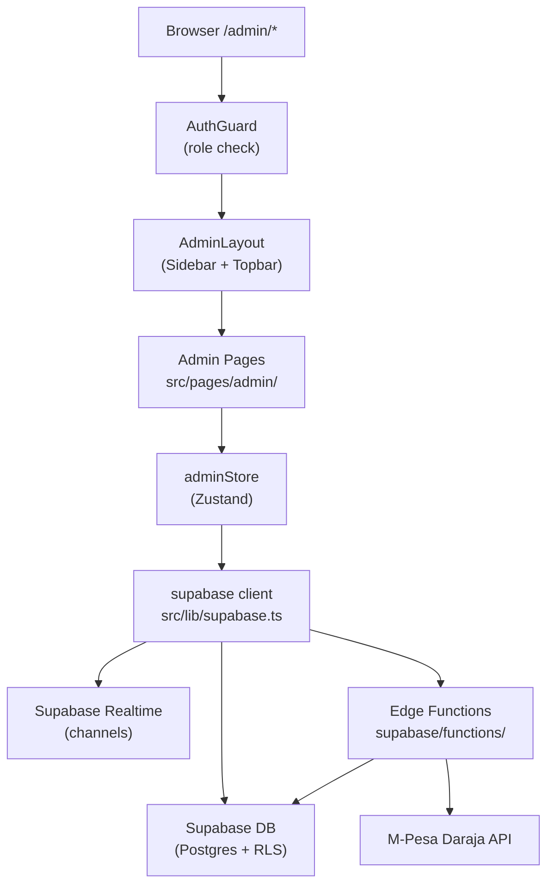

# Design Document: Casino Admin Panel

## Overview

The Casino Admin Panel is a role-gated management interface living at `/admin` within the existing React + TypeScript + Vite application. It shares the Neon Noir theme (dark backgrounds, neon yellow `#FFE600`, neon purple `#A855F7`) and is built entirely on the existing stack: Supabase for auth/database/realtime, Zustand for state, React Router v6 for routing, Tailwind CSS for styling, Recharts for charts, and Framer Motion for animations.

The panel introduces no separate backend server. All server-side logic runs via Supabase Edge Functions (extending the existing `supabase/functions/` directory). Real-time data flows through Supabase Realtime channel subscriptions. Role enforcement is handled by a new `Auth_Guard` component that reads the `admin_role` column on the `profiles` table.

### Design Goals

- Zero new infrastructure — extend Supabase, not add servers
- Strict RBAC at both the route level (React) and data level (Supabase RLS)
- Immutable audit trail for every admin action
- Real-time dashboard metrics via Supabase Realtime (no polling loops)
- Consistent neon noir aesthetic with glassmorphism cards

---

## Architecture



### Route Structure

```
/admin                    → redirect to /admin/dashboard
/admin/login              → AdminLoginPage (public)
/admin/dashboard          → DashboardPage        [super_admin, finance_admin]
/admin/users              → UsersPage             [super_admin, support_agent]
/admin/finance            → FinancePage           [super_admin, finance_admin]
/admin/games              → GamesPage             [super_admin, game_manager]
/admin/rtp                → RTPPage               [super_admin, game_manager]
/admin/jackpots           → JackpotsPage          [super_admin, game_manager]
/admin/live-tables        → LiveTablesPage        [super_admin, game_manager]
/admin/analytics          → AnalyticsPage         [super_admin, finance_admin]
/admin/fraud              → FraudPage             [super_admin]
/admin/audit              → AuditPage             [super_admin]
```

### Data Flow

1. On mount, `adminStore.init()` fetches the admin's profile and verifies `admin_role`
2. `AuthGuard` reads `adminStore.adminProfile` — redirects if role is absent or insufficient
3. Pages subscribe to `adminStore` slices; the store manages Supabase Realtime subscriptions
4. Mutations call Supabase directly (for simple CRUD) or invoke Edge Functions (for M-Pesa, complex operations)
5. Every mutation calls `auditLog()` helper which inserts into `admin_audit_logs`

---

## Components and Interfaces

### Layout Components (`src/components/admin/`)

```
AdminLayout.tsx          — wraps all admin pages; renders Sidebar + Topbar + <Outlet>
AdminSidebar.tsx         — role-filtered nav links, collapsible on mobile
AdminTopbar.tsx          — username, role badge, notification bell, sign-out
AdminAuthGuard.tsx       — route-level RBAC wrapper
ConfirmModal.tsx         — reusable destructive-action confirmation dialog
DataTable.tsx            — sortable, filterable, paginated table component
StatCard.tsx             — glassmorphism metric card
AlertsPanel.tsx          — real-time alerts list
LoadingSkeleton.tsx      — shimmer placeholder
ToastProvider.tsx        — toast notification context
```

### Page Components (`src/pages/admin/`)

```
AdminLoginPage.tsx
DashboardPage.tsx
UsersPage.tsx
UserDetailPage.tsx
FinancePage.tsx
GamesPage.tsx
RTPPage.tsx
JackpotsPage.tsx
LiveTablesAdminPage.tsx
AnalyticsPage.tsx
FraudPage.tsx
AuditPage.tsx
```

### AdminAuthGuard Interface

```typescript
interface AdminAuthGuardProps {
  requiredRoles: AdminRole[];  // roles allowed to access this route
}
// Renders <Outlet /> if role matches, redirects otherwise
```

### AdminSidebar Nav Item

```typescript
interface NavItem {
  label: string;
  path: string;
  icon: React.ComponentType;
  allowedRoles: AdminRole[];
}
```

---

## Data Models

### New Database Tables

```sql
-- Admin role column added to existing profiles table
ALTER TABLE profiles ADD COLUMN IF NOT EXISTS admin_role text
  CHECK (admin_role IN ('super_admin','finance_admin','support_agent','game_manager'));

ALTER TABLE profiles ADD COLUMN IF NOT EXISTS account_status text
  NOT NULL DEFAULT 'active'
  CHECK (account_status IN ('active','suspended','banned'));

-- Immutable audit log
CREATE TABLE admin_audit_logs (
  id              uuid PRIMARY KEY DEFAULT gen_random_uuid(),
  admin_id        uuid REFERENCES profiles(id) ON DELETE SET NULL,
  admin_role      text NOT NULL,
  action_type     text NOT NULL,
  target_entity   text,
  target_id       text,
  previous_value  jsonb,
  new_value       jsonb,
  ip_address      inet,
  created_at      timestamptz DEFAULT now()
);

-- RTP configuration (single-row config + history)
CREATE TABLE admin_rtp_config (
  id                uuid PRIMARY KEY DEFAULT gen_random_uuid(),
  target_rtp        numeric(5,4) NOT NULL DEFAULT 0.965,
  adjustment_strength numeric(5,4) NOT NULL DEFAULT 0.03,
  updated_by        uuid REFERENCES profiles(id) ON DELETE SET NULL,
  updated_at        timestamptz DEFAULT now()
);

-- Game configuration overrides
CREATE TABLE admin_game_config (
  id              uuid PRIMARY KEY DEFAULT gen_random_uuid(),
  game_id         text NOT NULL UNIQUE,
  enabled         boolean NOT NULL DEFAULT true,
  min_bet         numeric(10,2) NOT NULL DEFAULT 10,
  max_bet         numeric(10,2) NOT NULL DEFAULT 10000,
  volatility      text NOT NULL DEFAULT 'high',
  updated_by      uuid REFERENCES profiles(id) ON DELETE SET NULL,
  updated_at      timestamptz DEFAULT now()
);

-- Real-time alerts
CREATE TABLE admin_alerts (
  id          uuid PRIMARY KEY DEFAULT gen_random_uuid(),
  type        text NOT NULL, -- 'rtp_deviation' | 'large_payout' | 'fraud_flag'
  severity    text NOT NULL DEFAULT 'high', -- 'high' | 'medium' | 'low'
  message     text NOT NULL,
  metadata    jsonb,
  resolved    boolean NOT NULL DEFAULT false,
  created_at  timestamptz DEFAULT now()
);

-- Fraud flags
CREATE TABLE fraud_flags (
  id          uuid PRIMARY KEY DEFAULT gen_random_uuid(),
  user_id     uuid REFERENCES profiles(id) ON DELETE CASCADE,
  reason      text NOT NULL, -- 'rapid_high_bets' | 'high_win_rate'
  metadata    jsonb,
  dismissed   boolean NOT NULL DEFAULT false,
  bet_limit_applied boolean NOT NULL DEFAULT false,
  created_at  timestamptz DEFAULT now()
);
```

### TypeScript Types (`src/store/adminStore.ts`)

```typescript
export type AdminRole = 'super_admin' | 'finance_admin' | 'support_agent' | 'game_manager';

export interface AdminProfile {
  id: string;
  username: string;
  admin_role: AdminRole;
}

export interface AuditLogEntry {
  id: string;
  admin_id: string;
  admin_role: AdminRole;
  action_type: AuditActionType;
  target_entity: string | null;
  target_id: string | null;
  previous_value: unknown;
  new_value: unknown;
  ip_address: string | null;
  created_at: string;
}

export type AuditActionType =
  | 'balance_adjust' | 'user_suspend' | 'user_ban' | 'password_reset'
  | 'withdrawal_approve' | 'withdrawal_reject' | 'payment_retry'
  | 'game_toggle' | 'game_config_update'
  | 'table_create' | 'table_edit' | 'table_pause' | 'table_resume'
  | 'player_kick' | 'round_restart'
  | 'rtp_update' | 'jackpot_config_update' | 'jackpot_force_reset'
  | 'bet_limit_apply' | 'fraud_flag_dismiss';

export interface RTPConfig {
  id: string;
  target_rtp: number;
  adjustment_strength: number;
  updated_at: string;
}

export interface FraudFlag {
  id: string;
  user_id: string;
  reason: 'rapid_high_bets' | 'high_win_rate';
  metadata: Record<string, unknown>;
  dismissed: boolean;
  bet_limit_applied: boolean;
  created_at: string;
}

export interface AdminAlert {
  id: string;
  type: 'rtp_deviation' | 'large_payout' | 'fraud_flag';
  severity: 'high' | 'medium' | 'low';
  message: string;
  metadata: Record<string, unknown>;
  resolved: boolean;
  created_at: string;
}
```

### adminStore Shape

```typescript
interface AdminState {
  adminProfile: AdminProfile | null;
  loading: boolean;
  alerts: AdminAlert[];
  unreadAlertCount: number;

  // Actions
  init: () => Promise<void>;
  signOut: () => Promise<void>;
  subscribeToAlerts: () => () => void;  // returns unsubscribe fn
  auditLog: (entry: Omit<AuditLogEntry, 'id' | 'created_at' | 'admin_id' | 'admin_role'>) => Promise<void>;
  dismissAlert: (alertId: string) => Promise<void>;
}
```

### Idle Session Timeout

The `AdminAuthGuard` component tracks the last user interaction timestamp via `mousemove`/`keydown` event listeners. A `setInterval` running every 60 seconds checks if `Date.now() - lastActivity > 30 * 60 * 1000`. If so, it calls `supabase.auth.signOut()` and redirects to `/admin/login`.

---

## Correctness Properties

*A property is a characteristic or behavior that should hold true across all valid executions of a system — essentially, a formal statement about what the system should do. Properties serve as the bridge between human-readable specifications and machine-verifiable correctness guarantees.*

### Property 1: RBAC route access

*For any* admin user with a given `admin_role` and any `/admin` route with a required role list, the `AuthGuard` should grant access if and only if the user's role is in the required role list. For unauthenticated users, access should always be denied.

**Validates: Requirements 1.1, 1.2, 1.3, 1.10, 2.8, 3.10, 4.8, 5.8, 6.7, 7.7, 8.6, 9.6, 10.6, 11.6**

### Property 2: Invalid credentials never create a session

*For any* combination of email and password that does not match a valid admin account, the login attempt should return an error and the resulting session should be null.

**Validates: Requirements 1.5**

### Property 3: Invalid OTP is always rejected

*For any* OTP string that is not the current valid TOTP code for the admin's secret, the login attempt should be rejected and no session should be created.

**Validates: Requirements 1.7**

### Property 4: RTP deviation alert threshold

*For any* `targetRTP` and `currentRTP` values, an alert of type `rtp_deviation` should exist in the alerts list if and only if `|targetRTP - currentRTP| > 0.05`.

**Validates: Requirements 2.5**

### Property 5: Large payout alert threshold

*For any* payout transaction, an alert of type `large_payout` should be generated if and only if the payout amount exceeds KES 50,000.

**Validates: Requirements 2.6**

### Property 6: Fraud flag propagates to alerts

*For any* `fraud_flags` row where `dismissed = false`, a corresponding alert of type `fraud_flag` should appear in the Dashboard alerts panel.

**Validates: Requirements 2.7, 10.3**

### Property 7: Player search filters correctly

*For any* search term and list of player profiles, the filtered result should contain exactly those profiles whose `username` or `email` contains the search term (case-insensitive), and no others.

**Validates: Requirements 3.2**

### Property 8: Balance adjustment validity

*For any* player with current balance `b` and adjustment amount `a`, the adjustment should succeed and set the new balance to `b + a` if and only if `b + a >= 0`. If `b + a < 0`, the adjustment should be rejected and the balance should remain `b`.

**Validates: Requirements 3.4, 3.5**

### Property 9: Account status transitions

*For any* player account, after a `suspend` action the `account_status` should be `suspended`, and after a `ban` action the `account_status` should be `banned`.

**Validates: Requirements 3.6, 3.7**

### Property 10: Transaction filter correctness

*For any* set of transactions and a filter (date range, status), the filtered result should contain exactly those transactions that fall within the date range and match the status, and no others.

**Validates: Requirements 4.2**

### Property 11: Withdrawal approval/rejection state transitions

*For any* pending withdrawal with amount `a` and player balance `b`, after approval the transaction status should be `approved`; after rejection the transaction status should be `rejected` and the player's balance should be `b + a`.

**Validates: Requirements 4.4, 4.5**

### Property 12: CSV export contains all filtered records

*For any* set of transactions matching a filter, the generated CSV should contain exactly one data row per matching transaction, with all required columns present.

**Validates: Requirements 4.7, 9.5**

### Property 13: Game config validation

*For any* game configuration submission, the update should succeed if and only if `min_bet > 0`, `max_bet > min_bet`, and all payout multipliers are positive. Any submission violating these constraints should be rejected with field-level errors and no database write should occur.

**Validates: Requirements 5.3, 5.4**

### Property 14: Game toggle is idempotent in direction

*For any* game with enabled status `s`, after toggling, the status should be `!s`. Toggling twice should return to the original status `s`.

**Validates: Requirements 5.2**

### Property 15: RTP target range validation

*For any* submitted `targetRTP` value `v`, the update should succeed if and only if `0.85 <= v <= 0.99`. Any value outside this range should be rejected.

**Validates: Requirements 6.2, 6.3**

### Property 16: Adjustment strength range validation

*For any* submitted adjustment strength value `v`, the update should succeed if and only if `0.001 <= v <= 0.1`. Any value outside this range should be rejected.

**Validates: Requirements 6.4, 6.5**

### Property 17: RTP deviation calculation

*For any* `targetRTP` and `currentRTP`, the computed deviation percentage should equal `|targetRTP - currentRTP| * 100`, rounded to two decimal places.

**Validates: Requirements 6.1**

### Property 18: Jackpot config validation

*For any* jackpot configuration submission, the update should succeed if and only if `base_amount > 0`, `0.001 <= contribution_rate <= 0.1`, and `0.000001 <= trigger_probability <= 0.01`. Any submission violating these constraints should be rejected.

**Validates: Requirements 7.2, 7.3**

### Property 19: Jackpot force reset

*For any* jackpot pool with `base_amount` value `b`, after a force reset, `current_amount` should equal `b`.

**Validates: Requirements 7.4**

### Property 20: Live table pause/resume round-trip

*For any* active live table, pausing it sets status to `paused`; subsequently resuming it sets status back to `active`.

**Validates: Requirements 8.2, 8.3**

### Property 21: Player kick removes from table

*For any* live table session containing player `p`, after kicking player `p`, the player should not appear in the table's participant list.

**Validates: Requirements 8.4**

### Property 22: Round restart refunds all bets

*For any* live table round with a set of bets `{(player_i, amount_i)}`, after a round restart, each player `i`'s balance should increase by exactly `amount_i`.

**Validates: Requirements 8.5**

### Property 23: Fraud detection — rapid high bets

*For any* sequence of bets by a player, the player should be flagged if and only if there exists a 60-second window containing more than 20 bets each exceeding KES 5,000.

**Validates: Requirements 10.1**

### Property 24: Fraud detection — high win rate

*For any* rolling window of 50 consecutive bets by a player, the player should be flagged if and only if the number of winning bets divided by 50 exceeds 0.80.

**Validates: Requirements 10.2**

### Property 25: Auto-limit caps max bet

*For any* flagged player, after applying an auto-limit, the player's effective maximum bet should be KES 1,000 regardless of their previous limit.

**Validates: Requirements 10.4**

### Property 26: Fraud flag dismissal removes alert

*For any* fraud flag that is dismissed, the flag should not appear in the active alerts panel, and the `dismissed` field in `fraud_flags` should be `true`.

**Validates: Requirements 10.5**

### Property 27: Audit log completeness

*For any* admin action of a type listed in `AuditActionType`, the resulting `admin_audit_logs` row should contain non-null values for `admin_id`, `admin_role`, `action_type`, and `created_at`.

**Validates: Requirements 11.1, 11.4**

### Property 28: Audit log filter correctness

*For any* set of audit log entries and a filter (admin ID, action type, date range), the filtered result should contain exactly those entries matching all specified filter criteria.

**Validates: Requirements 11.2, 11.3**

### Property 29: Audit log immutability

*For any* admin role (including `super_admin`), attempts to `UPDATE` or `DELETE` rows in `admin_audit_logs` should be rejected by Supabase RLS.

**Validates: Requirements 11.5**

### Property 30: Sidebar shows only role-permitted sections

*For any* admin user with a given role, the sidebar navigation items rendered should be exactly the set of sections whose `allowedRoles` list includes that role — no more, no fewer.

**Validates: Requirements 12.3**

---

## Error Handling

### Auth Errors
- Invalid credentials → display inline error, no redirect
- Session expired / idle timeout → redirect to `/admin/login` with `?reason=timeout`
- Insufficient role → redirect to `/` with toast "Access Denied"

### Data Fetch Errors
- All Supabase queries wrapped in try/catch; errors dispatched to `ToastProvider`
- Realtime subscription disconnects trigger automatic reconnect via Supabase client built-in retry
- If a page fails to load data, show an error state with a "Retry" button

### Mutation Errors
- Validation errors shown inline at the field level (not as toasts)
- Network/server errors shown as toast notifications
- Audit log failures are logged to `console.error` but do not block the primary mutation (best-effort)

### M-Pesa Errors
- STK Push failures surface the Daraja error code in the transaction detail view
- Retry is available for `failed` status transactions only

---

## Testing Strategy

### Dual Testing Approach

Both unit tests and property-based tests are required. Unit tests cover specific examples, integration points, and edge cases. Property-based tests verify universal correctness across all valid inputs.

### Unit Tests

Focus areas:
- `AdminAuthGuard` renders `<Outlet />` for valid roles and redirects for invalid/missing roles (specific examples for each of the 4 roles)
- `auditLog()` helper inserts a row with all required fields
- Balance adjustment validation rejects negative-result adjustments
- RTP deviation calculation for known input/output pairs
- CSV export produces valid RFC 4180 CSV with correct headers
- Confirmation modal blocks destructive actions until confirmed

### Property-Based Tests

Library: **fast-check** (TypeScript-native, works with Vitest)

Configuration: minimum **100 runs** per property test.

Each test is tagged with a comment in the format:
`// Feature: casino-admin-panel, Property N: <property_text>`

**Property test list:**

| Property | Test Description |
|---|---|
| P1 | For any role + route combination, AuthGuard grants/denies correctly |
| P2 | For any invalid credential pair, login returns error and null session |
| P3 | For any invalid OTP string, login is rejected |
| P4 | For any targetRTP/currentRTP pair, alert exists iff deviation > 5% |
| P5 | For any payout amount, large-payout alert generated iff amount > 50000 |
| P6 | For any undismissed fraud flag, alert appears in dashboard |
| P7 | For any search term, filtered profiles contain only matching records |
| P8 | For any balance + adjustment, result is correct or rejected if negative |
| P9 | For any player, suspend sets status=suspended; ban sets status=banned |
| P10 | For any transactions + filter, result contains only matching records |
| P11 | For any pending withdrawal, approve/reject transitions are correct |
| P12 | For any filtered transaction set, CSV has correct rows and columns |
| P13 | For any game config, valid configs persist; invalid configs are rejected |
| P14 | For any game, toggling twice returns to original enabled status |
| P15 | For any targetRTP value, accepted iff in [0.85, 0.99] |
| P16 | For any adjustment strength, accepted iff in [0.001, 0.1] |
| P17 | For any targetRTP/currentRTP, deviation = \|target - current\| * 100 |
| P18 | For any jackpot config, valid configs persist; invalid configs are rejected |
| P19 | For any jackpot, force reset sets current_amount = base_amount |
| P20 | For any active table, pause then resume restores active status |
| P21 | For any table + player, kick removes player from participant list |
| P22 | For any round with bets, restart refunds each player exactly their bet |
| P23 | For any bet sequence, player flagged iff >20 bets >5000 in 60s window |
| P24 | For any 50-bet window, player flagged iff win rate > 80% |
| P25 | For any flagged player, auto-limit sets max_bet = 1000 |
| P26 | For any dismissed flag, flag absent from active alerts |
| P27 | For any admin action, audit log row has all required non-null fields |
| P28 | For any audit log + filter, result contains only matching entries |
| P29 | For any role, UPDATE/DELETE on audit_logs is rejected by RLS |
| P30 | For any role, sidebar items = exactly the permitted sections for that role |
