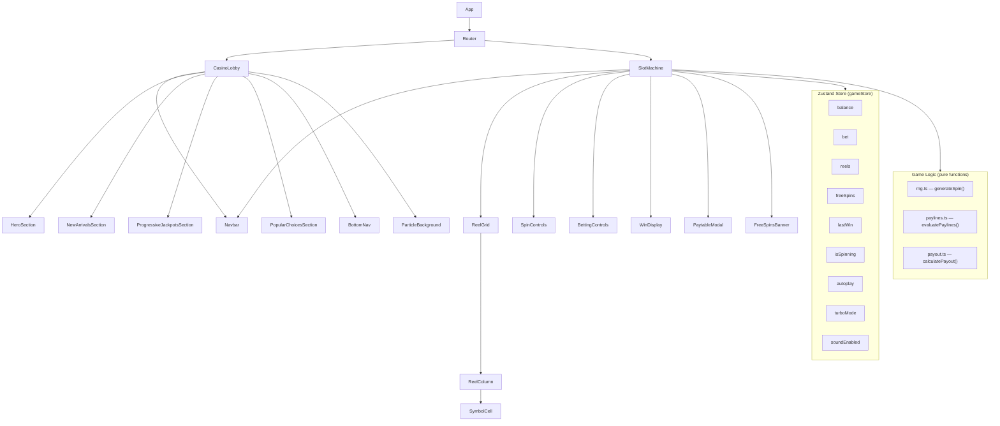

# Design Document: Neon Noir Casino

## Overview

Neon Noir Casino is a single-page React application delivering a cyberpunk-themed iGaming experience. It consists of two primary screens — a Casino Lobby and a Slot Machine — connected via client-side routing. The application is entirely frontend with no backend; all game logic runs client-side using a pseudo-RNG, and state is managed globally via Zustand.

The design prioritizes:
- Visual immersion through a dark neon aesthetic (glassmorphism, particle effects, Framer Motion animations)
- Correct game mechanics (weighted RNG, payline evaluation, balance management, free spins)
- Responsive layout from 320px to 1920px
- Modular, maintainable component architecture

### Technology Stack

| Concern | Technology |
|---|---|
| UI Framework | React 18 |
| Styling | TailwindCSS (custom theme) |
| Animation | Framer Motion |
| Global State | Zustand |
| Routing | React Router v6 |
| Property Testing | fast-check |
| Unit Testing | Vitest + React Testing Library |

---

## Architecture

The application follows a feature-based component architecture with a clear separation between UI, game logic, and state.



### Key Architectural Decisions

1. **Pure game logic functions**: `generateSpin`, `evaluatePaylines`, and `calculatePayout` are pure functions with no side effects. This makes them trivially testable and separates concerns from React rendering.
2. **Zustand for global state**: Balance, bet, spin state, and free spins are shared across Navbar (balance display) and SlotMachine. Zustand avoids prop drilling without the boilerplate of Redux.
3. **No backend**: All randomness is client-side `Math.random()`. This is appropriate for a demo/prototype; a production system would use server-side RNG with provably fair verification.
4. **React Router**: Two routes — `/` (lobby) and `/slot` (slot machine). Navigation is triggered by CTA buttons and game card clicks.

---

## Components and Interfaces

### Component Tree

```
src/
├── App.tsx                        # Router setup
├── main.tsx
├── store/
│   └── gameStore.ts               # Zustand store
├── config/
│   ├── symbols.ts                 # Symbol definitions, weights, multipliers
│   └── mockData.ts                # Game listings, jackpot data
├── logic/
│   ├── rng.ts                     # RNG and spin generation
│   ├── paylines.ts                # Payline definitions and evaluation
│   └── payout.ts                  # Payout calculation
├── components/
│   ├── Navbar.tsx
│   ├── BottomNav.tsx
│   ├── GameCard.tsx
│   ├── JackpotCard.tsx
│   ├── ParticleBackground.tsx
│   └── PaytableModal.tsx
├── pages/
│   ├── CasinoLobby.tsx
│   │   ├── HeroSection.tsx
│   │   ├── NewArrivalsSection.tsx
│   │   ├── ProgressiveJackpotsSection.tsx
│   │   └── PopularChoicesSection.tsx
│   └── SlotMachine.tsx
│       ├── ReelGrid.tsx
│       ├── ReelColumn.tsx
│       ├── SymbolCell.tsx
│       ├── SpinControls.tsx
│       ├── BettingControls.tsx
│       ├── WinDisplay.tsx
│       └── FreeSpinsBanner.tsx
└── styles/
    └── index.css                  # Tailwind directives + custom CSS vars
```

### Key Component Interfaces

```typescript
// GameCard
interface GameCardProps {
  id: string;
  title: string;
  thumbnail: string;
  badge: 'HOT' | 'NEW';
  onClick: () => void;
}

// JackpotCard
interface JackpotCardProps {
  name: string;
  amount: number;          // live-updating value
  tags: string[];
  onSpinNow: () => void;
}

// ReelColumn
interface ReelColumnProps {
  symbols: Symbol[];       // 3 visible symbols
  isSpinning: boolean;
  stopDelay: number;       // ms stagger offset (col index * 150)
  winningRows: number[];   // row indices to highlight
}

// SymbolCell
interface SymbolCellProps {
  symbol: Symbol;
  isWinning: boolean;
}

// PaytableModal
interface PaytableModalProps {
  isOpen: boolean;
  onClose: () => void;
}
```

### Zustand Store Interface

```typescript
interface GameState {
  // State
  balance: number;
  bet: number;
  reels: Symbol[][];       // [col][row], 5 cols x 3 rows
  freeSpinsRemaining: number;
  lastWin: number;
  isSpinning: boolean;
  autoplay: boolean;
  turboMode: boolean;
  soundEnabled: boolean;
  freeSpinsTotalWin: number;

  // Actions
  spin: () => void;
  setBet: (direction: 'up' | 'down') => void;
  toggleAutoplay: () => void;
  toggleTurboMode: () => void;
  toggleSound: () => void;
  openPaytable: () => void;
  closePaytable: () => void;
}
```

---

## Data Models

### Symbol Definition

```typescript
type SymbolId =
  | 'bell' | 'star' | 'heart' | 'diamond' | 'coin'
  | 'shield' | 'skull' | 'token' | 'seven'
  | 'wild' | 'scatter';

interface Symbol {
  id: SymbolId;
  label: string;
  emoji: string;           // fallback icon (e.g. '🔔')
  weight: number;          // relative probability weight
  multiplier: number;      // payout multiplier for 3-of-a-kind
  isPremium: boolean;
}
```

### Symbol Weight Table

| Symbol | Weight | Multiplier | Notes |
|---|---|---|---|
| Bell | 20 | 1x | Standard |
| Star | 18 | 1x | Standard |
| Heart | 18 | 1x | Standard |
| Diamond | 15 | 2x | Standard |
| Coin | 15 | 2x | Standard |
| Shield | 12 | 3x | Standard |
| Skull | 12 | 3x | Standard |
| Token | 10 | 4x | Standard |
| Seven | 6 | 5x | Premium |
| Wild | 3 | — | Substitutes all standard |
| Scatter | 3 | — | Triggers free spins |

Total weight: 132. Premium symbols (Wild, Scatter, Seven) collectively have weight 12/132 ≈ 9%.

### Payline Definitions

The slot uses a 5-column × 3-row grid (columns 0–4, rows 0–2):

```typescript
type Payline = [number, number, number, number, number]; // row index per column

const PAYLINES: Payline[] = [
  [0, 0, 0, 0, 0], // top row
  [1, 1, 1, 1, 1], // middle row
  [2, 2, 2, 2, 2], // bottom row
  [0, 1, 2, 1, 0], // V-shape
  [2, 1, 0, 1, 2], // inverted V
];
```

### Bet Ladder

```typescript
const BET_LADDER = [0.20, 0.50, 1.00, 2.00, 5.00, 10.00, 20.00, 50.00, 100.00];
```

### Win Result

```typescript
interface WinResult {
  paylineIndex: number;
  matchedSymbol: SymbolId;
  matchCount: number;       // 3, 4, or 5
  cells: [number, number][]; // [col, row] pairs
  payout: number;
}
```

### Game Data (Mock)

```typescript
interface GameListing {
  id: string;
  title: string;
  thumbnail: string;
  badge: 'HOT' | 'NEW';
  rtp: number;
  volatility: 'Low' | 'Medium' | 'High';
}

interface JackpotData {
  id: string;
  name: string;
  baseAmount: number;
  tags: string[];
}
```

### RNG Spin Output

```typescript
type SpinGrid = SymbolId[][];  // [col][row], always 5x3
```

---

## Correctness Properties

*A property is a characteristic or behavior that should hold true across all valid executions of a system — essentially, a formal statement about what the system should do. Properties serve as the bridge between human-readable specifications and machine-verifiable correctness guarantees.*

### Property 1: Spin grid is always complete and valid

*For any* call to `generateSpin()`, the result SHALL be a 5×3 grid where every cell contains exactly one valid symbol from the defined symbol set.

**Validates: Requirements 11.4**

---

### Property 2: Reel independence

*For any* two columns in a generated spin grid, the symbol at one column is statistically independent of the symbol at another column — i.e., generating a spin 1000 times, the distribution of symbols in column 0 should not be correlated with column 1.

*Practical formulation*: For any spin, each column is generated by an independent draw from the weighted distribution. No column's output is derived from another column's output.

**Validates: Requirements 11.2**

---

### Property 3: Weighted symbol distribution

*For any* large sample of generated spins (≥ 1000), the observed frequency of each symbol across all cells should approximate its configured weight relative to the total weight, within a reasonable statistical tolerance.

**Validates: Requirements 11.1**

---

### Property 4: Payout calculation correctness

*For any* win result with a matched symbol, match count, and bet amount, the calculated payout SHALL equal `bet × symbol.multiplier × matchCount`.

**Validates: Requirements 12.4**

---

### Property 5: Wild substitution in payline evaluation

*For any* payline where replacing one or more cells with a Wild symbol would complete a 3+ match, `evaluatePaylines()` SHALL detect that win as if the Wild were the matched symbol.

**Validates: Requirements 12.3**

---

### Property 6: Balance deduction on spin

*For any* spin initiated outside of free spins, the player balance after initiating the spin SHALL equal the balance before minus the current bet.

**Validates: Requirements 14.2**

---

### Property 7: Balance addition on win

*For any* spin that produces a win, the player balance after the spin resolves SHALL equal the balance before the spin result was applied plus the total payout of all winning paylines.

**Validates: Requirements 12.6, 14.3**

---

### Property 8: Free spins do not deduct balance

*For any* spin taken during the free spins bonus round, the player balance SHALL remain unchanged at the point of spin initiation (no bet deduction).

**Validates: Requirements 13.2**

---

### Property 9: Free spins count decrements correctly

*For any* free spin taken, the remaining free spin count SHALL decrease by exactly 1, and SHALL reach 0 after exactly 10 free spins have been consumed.

**Validates: Requirements 13.1, 13.4**

---

### Property 10: Bet ladder boundary enforcement

*For any* bet at the minimum ladder value, clicking minus SHALL leave the bet unchanged. For any bet at the maximum ladder value, clicking plus SHALL leave the bet unchanged.

**Validates: Requirements 10.4, 10.5**

---

### Property 11: Scatter trigger threshold

*For any* spin grid containing 3 or more Scatter symbols anywhere in the 5×3 grid, `evaluatePaylines()` SHALL signal the free spins trigger. For any grid with fewer than 3 Scatter symbols, it SHALL NOT trigger free spins.

**Validates: Requirements 12.7**

---

### Property 12: Win detection completeness

*For any* spin grid, every payline that contains 3 or more consecutive matching symbols (or Wild-substituted matches) starting from column 0 SHALL be included in the win results, and no payline without such a match SHALL be included.

**Validates: Requirements 12.1, 12.2**

---

### Property 13: Paytable displays all symbol multipliers

*For any* symbol in the standard symbol set (Diamond, Token, Chip, Seven, Cherry), the rendered paytable modal SHALL include that symbol's configured payout multiplier value.

**Validates: Requirements 15.4**

---

## Error Handling

| Scenario | Handling |
|---|---|
| Balance < current bet | SPIN button disabled; "Insufficient Balance" indicator shown |
| Balance = $0.00 | SPIN button disabled; "No Funds" message shown; Autoplay disabled |
| Autoplay active + balance = $0.00 | Autoplay automatically disabled; notification shown to player |
| Spin triggered while spinning | SPIN button disabled during animation; concurrent spins impossible |
| Free spins count reaches 0 | Bonus round ends; summary modal shown; normal play resumes |
| Reduced-motion media query active | Particle background disabled; animation durations minimized |

All error states are derived from Zustand store values and rendered reactively — no thrown exceptions for expected game states.

---

## Testing Strategy

### Dual Testing Approach

Both unit tests and property-based tests are required. They are complementary:
- Unit tests catch concrete bugs with specific known inputs/outputs
- Property tests verify universal correctness across the full input space

### Unit Tests (Vitest + React Testing Library)

Focus areas:
- Specific payline evaluation examples (known grids → known win results)
- Balance initialization to $1,000.00
- Free spins summary display after bonus round ends
- Paytable modal open/close behavior
- Navbar balance formatting (e.g. `25400` → `$25,400.00`)
- Jackpot counter increments within the $0.01–$2.00 range
- Shimmer placeholders render during loading state

### Property-Based Tests (fast-check, minimum 100 iterations each)

Each correctness property from the design document maps to exactly one property-based test. Tests are tagged with the following format:

**Tag format**: `Feature: neon-noir-casino, Property {N}: {property_text}`

| Test | Design Property | fast-check Arbitraries |
|---|---|---|
| Spin grid validity | Property 1 | `fc.constant(null)` → call generateSpin, assert shape |
| Payout formula | Property 4 | `fc.record({ bet, multiplier, matchCount })` |
| Wild substitution | Property 5 | `fc.array(symbolId)` with injected wilds |
| Balance deduction | Property 6 | `fc.float({ min: 0.20, max: 1000 })` for balance/bet pairs |
| Balance addition on win | Property 7 | `fc.record({ balance, winResults })` |
| Free spins no deduction | Property 8 | `fc.integer({ min: 1, max: 10 })` for free spin count |
| Free spins decrement | Property 9 | `fc.integer({ min: 1, max: 10 })` |
| Bet ladder boundaries | Property 10 | `fc.constantFrom(...BET_LADDER)` |
| Scatter trigger | Property 11 | `fc.array` of grids with controlled scatter counts |
| Win detection completeness | Property 12 | `fc.array` of symbol grids |
| Paytable symbol multipliers | Property 13 | `fc.constantFrom(...standardSymbols)` |

**Configuration**: Each property test runs a minimum of 100 iterations (`fc.assert(fc.property(...), { numRuns: 100 })`).

### Test File Structure

```
src/
└── __tests__/
    ├── rng.test.ts           # Properties 1, 2, 3
    ├── paylines.test.ts      # Properties 5, 11, 12
    ├── payout.test.ts        # Property 4
    ├── store.test.ts         # Properties 6, 7, 8, 9, 10
    └── components/
        ├── Navbar.test.tsx
        ├── BettingControls.test.tsx
        └── PaytableModal.test.tsx
```
